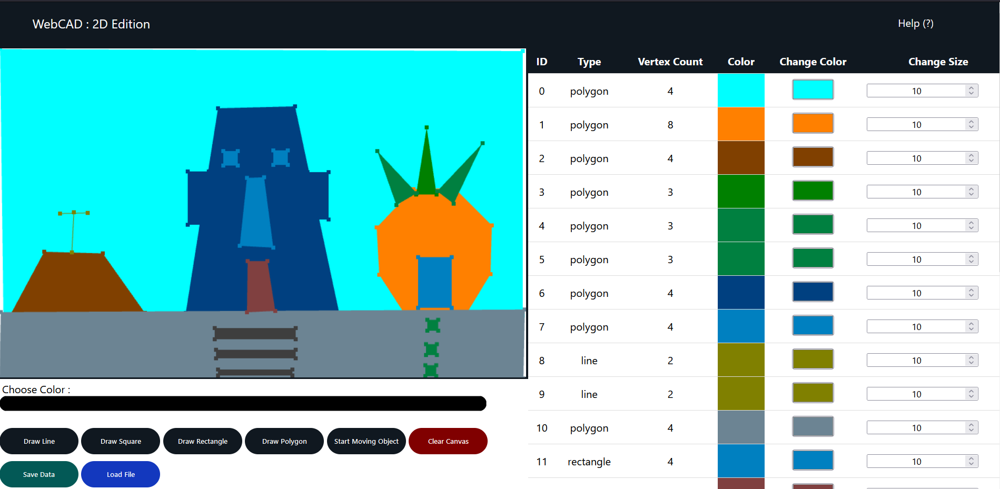

# IF3260 Computer Graphics : Project 1 
> 2D Web Based Computer-aided Design 

## Table of contents
  - [Description](#description)
  - [Requirements](#requirements)
  - [How to Use](#how-to-use)
  - [Contributors](#contributors)

## Description
2D Web Based Computer-aided Design Web App implemented using JavaScript and WebGL.\
Can be accessed at https://moshval.github.io/web-based-cad/ \
Features:
- Draw Shapes (Line, Square, Rectangle, Polygon)
- Drag Drawn Shapes Vertices
- Move Drawn Shapes
- Change Shapes Length/Scale
- Change Shapes Color
- Delete Shapes
- Reset Canvas State
- Save Canvas State to External File 
- Load Canvas State from External File

Documentation at [this link](https://docs.google.com/document/d/13TviZM4xnvBau8WSSCQ7NOz33796fFBseRK3f_i8A0o/edit?usp=sharing) 

## Requirements
- [Javascript is enabled](https://www.enable-javascript.com/)
- [WebGL-supported Web Browser](https://get.webgl.org/)

## How to Use
1. Open Project Directory, Run [index.html](index.html) in the Web Browser
2. The app is now running in the Web Browser
3. Help menu is located at the top right corner of the page
  
## Contributors
K01 Group 3 :
- Arif Rahman Amrul Ghani (13518023)
- Mohammad Sheva Almeyda Sofjan (13519018)
- Ridho Daffasyah (13519038)
